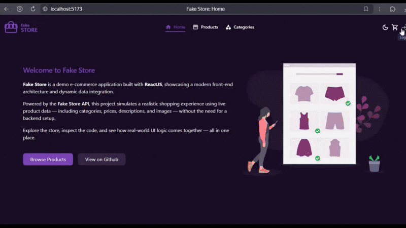

# Welcome to Fake Store

**Fake Store** is a demo e-commerce application built with **ReactJS**, showcasing a modern front-end architecture and dynamic data integration.

Powered by the **[Fake Store API](https://fakestoreapi.com)**, this project simulates a realistic shopping experience using live product data — including categories, prices, descriptions, and images — without the need for a backend setup.

Explore the store, inspect the code, and see how real-world UI logic comes together — all in one place.

The interface is optimized for both **desktop and mobile versions**. Additionally, it supports **light and dark themes**, automatically adapting to the system's default settings.

Uses: **\_React 19.1, Typescript 5.8, TailwindCSS 4, Base-UI 1.0.0-beta**
